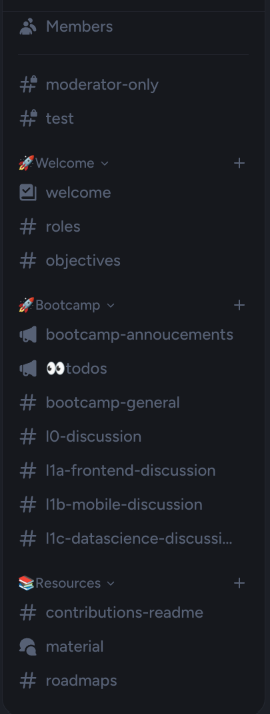

# GJU IT Club — Discord Role Bot

A small Discord bot created by me in **2023** for the German‑Jordanian University (GJU) IT Club. Students react with emojis to get roles (major, interests, year) so they only see the channels and resources they need.

---

## About the Discord Server

- Managed by the **GJU IT Club** community with 150+ members.
- Channel groups include **Welcome**, **Bootcamp**, and **Resources**.

- The sidebar is structured to help IT students easily find what matters:
  - **Roles** include majors, interests, and years—covering everything from AI/ML to Cybersecurity, Web, and App Development.
  - **Resources** include materials to help with exams, assignments, and curated roadmaps for different IT career paths.
  - **Bootcamp** channels include course announcements and discussion spaces for each learning track (frontend, mobile, data, etc.).
- We hosted short online courses and study sessions; some selected recordings are available on our YouTube channel: [@gjuitclub](https://www.youtube.com/@gjuitclub).

---

## Features

- **Emoji role picker** for Major, Interests, and Year.
- Instant role switching—change reaction, role updates.
- Token safely stored in Heroku Config Vars.

---

## Tech Stack

- Python + `discord.py`
- `python-dotenv` for environment variables
- Deployed on a Heroku **worker** dyno

---

## Deploy to Heroku

1. Fork or clone this repo.
2. In the Heroku dashboard, go to **Settings → Config Vars** and add:
   - `DISCORD_TOKEN = your‑bot‑token`
3. Connect the repo under the **Deploy** tab and click **Deploy Branch** (or enable automatic deploys).
4. In **Resources**, switch on the *worker* dyno.

---

Originally private in 2023, later open‑sourced in 2025 after removing the hard‑coded token and redeploying to Heroku.

